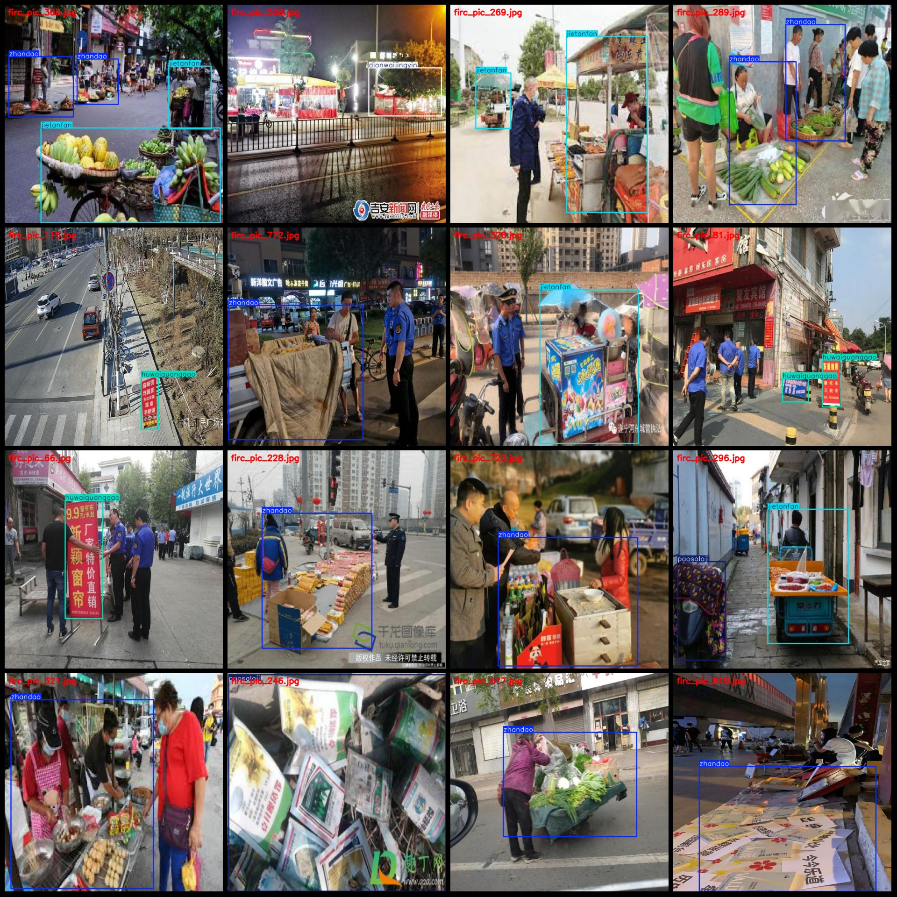
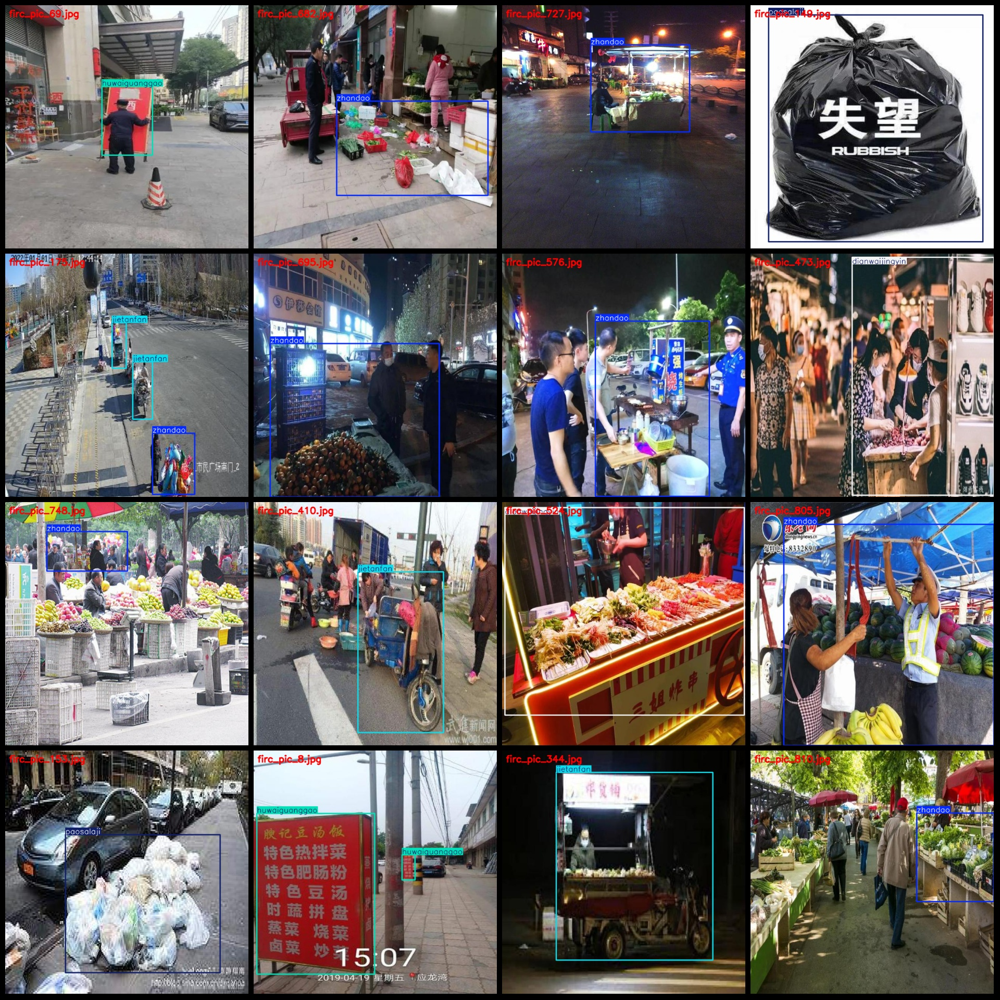

# City Operation Behavior Dataset: Discarded Garbage, Out-of-Bounds Advertisement Signs, Mobile Food Stalls, and Obstruction of Roadways Detection Dataset in VOC+YOLO Format with 856 Images in 5 
Classes

Dataset Format: Pascal VOC format + YOLO format (txt files without split paths, containing only jpg images along with corresponding VOC format xml files and YOLO format txt files).
Number of Image Files (jpg): 856
Number of Annotation Files (xml): 856
Number of Annotation Files (txt): 856
Number of Annotation Categories: 5
Annotation Categories List (note that the order of labels in the YOLO format does not correspond to this list but rather to the "labels" folder's "classes.txt"): ["dianwaijingyin", "huwaiguanggao", 
"jietanfan", "paosalaji", "zhandao"]
Number of Boxes per Classification:
dianwaijingyin (Out-of-Bounds Business / Storefront Protruding, Merchant placing goods, tables, or goods outside sidewalks on public road) = 178
huwaiguanggao (Streetside Advertising / Outdoor Billboards, Wall banners, lightboxes, illegal outdoor advertising) = 175
jietanfan (Mobile Food Stall / Street Vendors, no fixed stalls, vendors selling on sidewalks or roadsides) = 233
paosalaji (Sprayed Waste / Roadside Scraps, waste materials thrown by vehicles or pedestrians on the road) = 117
zhandao (Obstacles on Roadways / Obstacles on Motorway/Sidewalks) = 476
Total Box Count: 1179
Number of Images per Classification:
dianwaijingyin (Images count = 149)
huwaiguanggao (Images count = 123)
jietanfan (Images count = 178)
paosalaji (Images count = 104)
zhandao (Images count = 379)
Image Resolution: 640x640
Annotation Tool Used: labelImg
Annotation Rules: Draw bounding boxes for the categories
Important Note: The dataset is not divided into training, validation, or test sets and must be manually partitioned.
Special Notice: This dataset does not guarantee any level of accuracy for models trained on it or the weights file.
Image Preview:
Annotation Example:

## Images

Here is a pay link on Stripe ( https://buy.stripe.com/3cs8yP7sY87d0vu9AB ). Please contact me lonlonago@foxmail.com after funding $89, and I will send you a complete data files , thank you!

